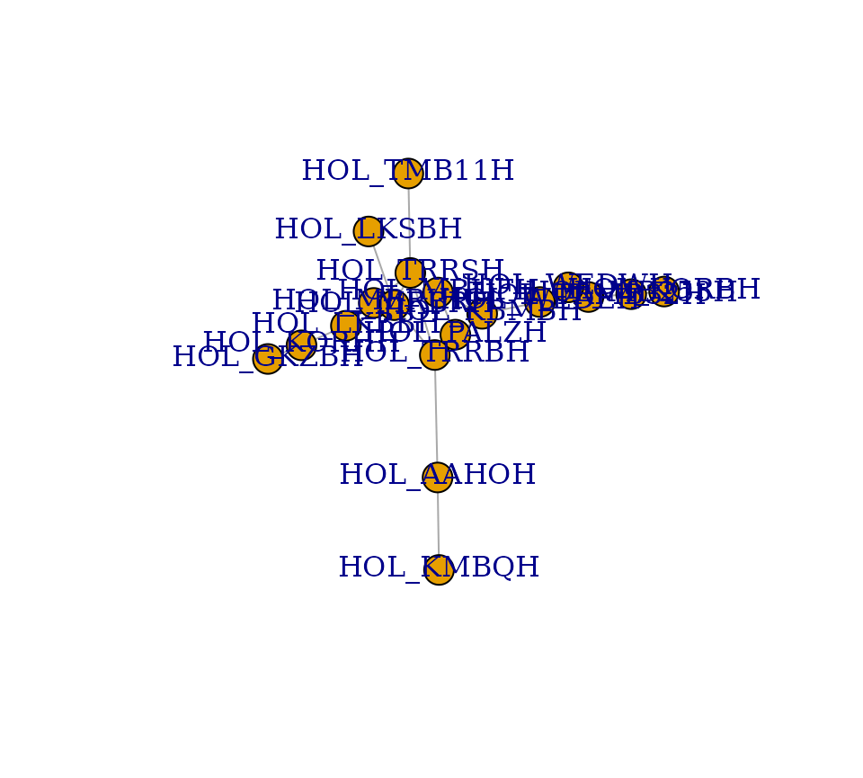
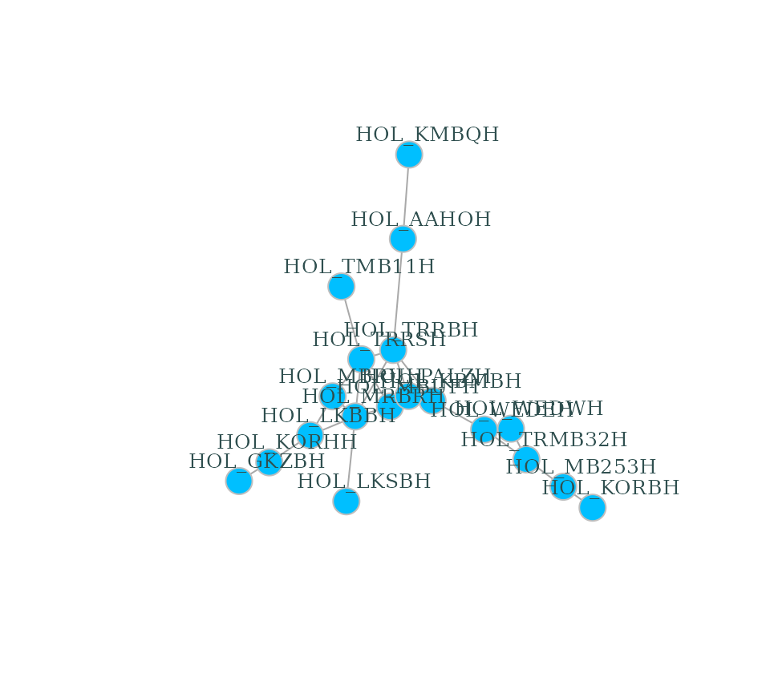

# dendroNetwork: how to use it

dendroNetwork is a package to create dendrochronological networks for
gaining insight into provenance or other patterns based on the
statistical relations between tree ring curves. The code and the
functions are based on several published papers (Visser 2021, 2021;
Visser and Vorst 2022).

The package is written for dendrochronologists and have a general
knowledge on the discipline and used jargon. There is an excellent
website for the introduction of using R in dendrochronology:
<https://opendendro.org/r/>. The basics of dendrochronology can be found
in handbooks (Cook and Kariukstis 1990; Speer 2010) or on
<https://www.dendrohub.com/>.

## Usage

The package aims to make the creation of dendrochronological
(provenance) networks as easy as possible. To be able to make use of all
options, it is assumed that Cytoscape (Shannon et al. 2003) is installed
(<https://cytoscape.org/>). Cytoscape is open source software and
platform independent and provides easy visual access to complex
networks, including the attributes of both nodes and edges in a network
(see the
[Cytoscape-website](https://cytoscape.org/what_is_cytoscape.html) for
more information). Some data is included in this package, namely the
Roman data published by Hollstein (Hollstein 1980).

The first steps are visualized in the flowchart below, including
community detection using either (or both) the Girvan-Newman algorithm
(Girvan and Newman 2002) and Clique Percolation Method (Palla et al.
2005) for all clique sizes. Both methods are explained very well in the
papers, and on wikipedia for both
[CPM](https://en.wikipedia.org/wiki/Clique_percolation_method) and the
[Girvan-Newman
algorithm](https://en.wikipedia.org/wiki/Girvan%E2%80%93Newman_algorithm).
More information on the dendrochronological data can be found in a
separate
[vignette](https://docs.ropensci.org/dendroNetwork/articles/dendrochronological_data.md).

``` r

library(dendroNetwork)
data(hol_rom) # 1
sim_table_hol <- sim_table(hol_rom) # 2
g_hol <- dendro_network(sim_table_hol) # 3
g_hol_gn <- gn_names(g_hol) # 4
g_hol_cpm <- clique_community_names(g_hol, k=3) # 4
hol_com_cpm_all <- find_all_cpm_com(g_hol) # 5
# plotting the graph in R
plot(g_hol)  
```



``` r

# better readable version
plot(g_hol, vertex.color="deepskyblue", vertex.size=15, vertex.frame.color="gray",
     vertex.label.color="darkslategrey", vertex.label.cex=0.8, vertex.label.dist=2) 
```



For large datasets of tree-ring series see also
[`vignette("large_datasets_communities")`](https://docs.ropensci.org/dendroNetwork/articles/large_datasets_communities.md)
.

### Visualization in Cytoscape

After creating the network in R, it is possible to visualize the network
using Cytoscape. The main advantage is that visualisation in Cytoscape
is more easy, intuitive and visual. In addition, it is very easy to
automate workflows in Cytoscape with R (using
[RCy3](https://bioconductor.org/packages/release/bioc/html/RCy3.html)).
For this purpose we need to start Cytoscape firstly. After Cytoscape has
completely loaded, the next steps can be taken.

1.  The network can now be loaded in Cytoscape for further
    visualisation:
    `cyto_create_graph(g_hol, CPM_table = hol_com_cpm_all, GN_table = g_hol_gn)`
2.  Styles for visualisation can now be generated. However, Cytoscape
    comes with a lot of default styles that can be confusing. Therefore
    it is recommended to use:
    [`cyto_clean_styles()`](https://docs.ropensci.org/dendroNetwork/reference/cyto_clean_styles.md)
    once in a session.
3.  To visualize the styles for CPM with only k=3:
    `cyto_create_cpm_style(g_hol, k=3, com_k = g_hol_cpm)`
    - This can be repeated for all possible clique sizes. To find the
      maximum clique size in a network, please use:
      `igraph::clique_num(g_hol)`.
    - To automate this:
      `for (i in 3:igraph::clique_num(g_hol)) { cyto_create_cpm_style(g_hol, k=i, com_k = g_hol_cpm)}`.
4.  To visualize the styles using the Girvan-Newman algorithm (GN):
    `cyto_create_gn_style(g_hol)` This would look something like this in
    Cytoscape:


The network of Roman sitechronologies with the Girvan-Newman communities
visualized.

A more complete description of using Cytoscape with this package can be
found here:
[`vignette("large_datasets_communities")`](https://docs.ropensci.org/dendroNetwork/articles/large_datasets_communities.md)
.

## Citation

If you use this software, please cite this using:

Visser, R. (2024). DendroNetwork: a R-package to create
dendrochronological provenance networks (Version 0.5.0) \[Computer
software\]. <https://zenodo.org/doi/10.5281/zenodo.10636310>

## References

Cook, ER and Kariukstis, LA. 1990. *Methods of dendrochronology.
Applications in the environmental sciences*. Dordrecht: Kluwer Academic
Publishers.

Girvan, M and Newman, MEJ. 2002 Community structure in social and
biological networks. *Proceedings of the National Academy of Sciences of
the United States of America* 99(12): 7821–7826. DOI:
https://doi.org/[10.1073/pnas.122653799](https://doi.org/10.1073/pnas.122653799).

Hollstein, E. 1980. *Mitteleuropäische eichenchronologie. Trierer
dendrochronologische forschungen zur archäologie und kunstgeschichte.*
Trierer grabungen und forschungen 11. Mainz am Rhein: Verlag Philipp von
Zabern.

Palla, G, Derenyi, I, Farkas, I and Vicsek, T. 2005 Uncovering the
overlapping community structure of complex networks in nature and
society. *Nature* 435(7043): 814–818. DOI:
https://doi.org/[10.1038/nature03607](https://doi.org/10.1038/nature03607).

Shannon, P, Markiel, A, Ozier, O, Baliga, NS, Wang, JT, Ramage, D, Amin,
N, Schwikowski, B and Ideker, T. 2003 Cytoscape: A software environment
for integrated models of biomolecular interaction networks. *Genome
Research* 13(11): 2498–2504. DOI:
https://doi.org/[10.1101/gr.1239303](https://doi.org/10.1101/gr.1239303).

Speer, JH. 2010. *Fundamentals of tree ring research*. Tucson:
University of Arizona Press.

Visser, RM. 2021 Dendrochronological provenance patterns. Network
analysis of tree-ring material reveals spatial and economic relations of
roman timber in the continental north-western provinces. *Journal of
Computer Applications in Archaeology* 4(1): 230–253. DOI:
https://doi.org/[10.5334/jcaa.79](https://doi.org/10.5334/jcaa.79).

Visser, RM and Vorst, Y. 2022 Connecting Ships: Using
Dendrochronological Network Analysis to Determine the Wood Provenance of
Roman-Period River Barges Found in the Lower Rhine Region and Visualise
Wood Use Patterns. *International Journal of Wood Culture* 3(1-3):
123–151. DOI:
https://doi.org/[10.1163/27723194-bja10014](https://doi.org/10.1163/27723194-bja10014).
